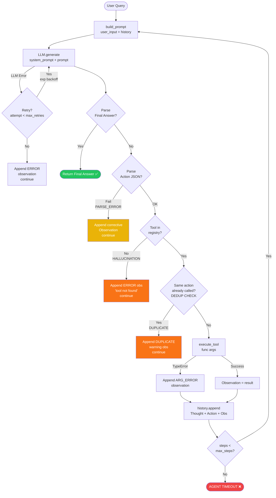
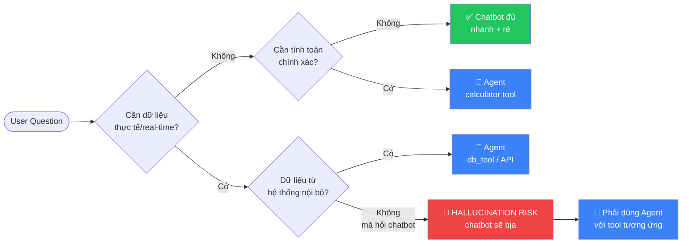
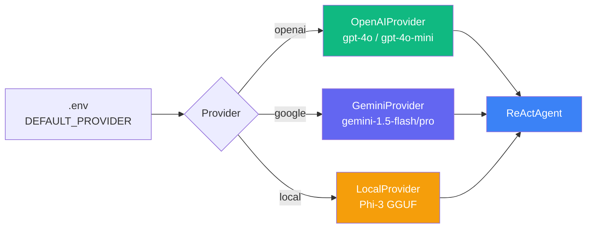

# Phase 8: Flowchart & Group Insights

## 1. ReAct Loop Flowchart (Mermaid)



---

## 2. Architecture Diagram

```
┌─────────────────────────────────────────────────────────────────┐
│                        ReAct Agent v2                            │
│                                                                   │
│  ┌───────────────┐    ┌───────────────┐    ┌─────────────────┐  │
│  │  LLMProvider  │    │  Tool Registry │    │   Telemetry     │  │
│  │  (interface)  │    │  (Dict lookup) │    │                 │  │
│  │               │    │               │    │  IndustryLogger │  │
│  │  ┌──────────┐ │    │ ┌───────────┐ │    │  → logs/*.log   │  │
│  │  │ OpenAI   │ │    │ │calculator │ │    │                 │  │
│  │  ├──────────┤ │    │ ├───────────┤ │    │  PerfTracker    │  │
│  │  │ Gemini   │ │    │ │check_stock│ │    │  → cost, lat,   │  │
│  │  ├──────────┤ │    │ ├───────────┤ │    │    tokens       │  │
│  │  │  Local   │ │    │ │calc_ship  │ │    └─────────────────┘  │
│  │  └──────────┘ │    │ ├───────────┤ │                          │
│  └───────────────┘    │ │db_tool    │ │    ┌─────────────────┐  │
│                        │ ├───────────┤ │    │  Guards (v2)    │  │
│                        │ │model_eval │ │    │                 │  │
│                        │ └───────────┘ │    │  ✓ Halluc guard │  │
│                        └───────────────┘    │  ✓ Dedup guard  │  │
│                                             │  ✓ Retry backoff│  │
│                                             └─────────────────┘  │
└─────────────────────────────────────────────────────────────────┘
```

---

## 3. Chatbot vs Agent — Decision Tree



---

## 4. Group Learning Points

### 4.1 Khi nào Agent thắng Chatbot (Multi-step Reasoning)?

**Agent thắng ở 3 trường hợp cụ thể:**

| Tình huống | Chatbot | Agent | Lý do Agent thắng |
|---|---|---|---|
| Tra cứu tồn kho thực | Bịa số lượng | Gọi `check_stock` → thực tế | Observation từ tool = sự thật |
| Tính toán phức tạp nhiều bước | Có thể sai rounding | Dùng `calculator` mỗi bước | Mỗi Observation xác nhận intermediate result |
| Multi-tool chain (weight → shipping → coupon → final) | Chỉ estimate | 4 tool calls chính xác | Agent decompose bài toán thành steps độc lập |

**Bài học cốt lõi:** Khối `Thought` buộc LLM phải *viết ra* kế hoạch trước khi hành động. Điều này loại bỏ nhảy cóc logic — agent không thể bỏ qua bước tính shipping rồi đưa ra tổng sai.

### 4.2 Khi nào Chatbot thắng Agent (Simple Q&A)?

| Tình huống | Chatbot | Agent | Lý do Chatbot thắng |
|---|---|---|---|
| "2 + 2 = ?" | ✅ 1 LLM call | 🐢 2+ calls | Agent overhead không cần thiết |
| Câu hỏi kiến thức (history, định nghĩa) | ✅ Trả lời tốt | Không cần tool | LLM đã biết — không cần grounding |
| Chi phí thấp | Rẻ hơn ~3-5x | Tốn hơn | Nhiều token vì history accumulation |

**Bài học cốt lõi:** ReAct Agent có overhead cố định — system prompt, history, parsing. Với queries đơn giản, đây là cost vô ích. Production system nên có *router* chọn Chatbot hay Agent theo độ phức tạp của query.

### 4.3 Vai trò của Observation trong ReAct Loop

```
Thought: "Tôi cần kiểm tra tồn kho Macbook Pro M3"
Action: check_stock("Macbook Pro M3")
Observation: "In stock — 5 units available."   ← GROUNDING MOMENT
                                                 ← Agent biết sự thật
Thought: "Đã xác nhận còn hàng. Giờ tính giá..."
```

- **Không có Observation** → Agent phải dự đoán kết quả tool → dễ sai
- **Với Observation** → Agent chỉ cần *đọc* kết quả và tiếp tục → reliable
- Đây là sự khác biệt căn bản giữa ReAct và Chain-of-Thought thuần túy

### 4.4 Bài học từ Error Analysis (Phase 5)

1. **Prompt engineering quan trọng hơn model size**: Chỉ thêm few-shot example và step-count vào system prompt đã giảm đáng kể parse errors — không cần model lớn hơn
2. **Guard ở execution layer > Guard ở prompt**: Hallucination guard trong code (trước khi gọi tool) đáng tin hơn chỉ dặn LLM "đừng bịa tool"
3. **Telemetry là bắt buộc**: Nếu không có log JSON từng bước, không thể debug được infinite loop hay hallucination pattern
4. **Token cost tuyến tính với history**: Mỗi step thêm ~100-200 tokens vào context → cần `max_steps` guard để kiểm soát chi phí

---

## 5. Flowchart Provider Switching


