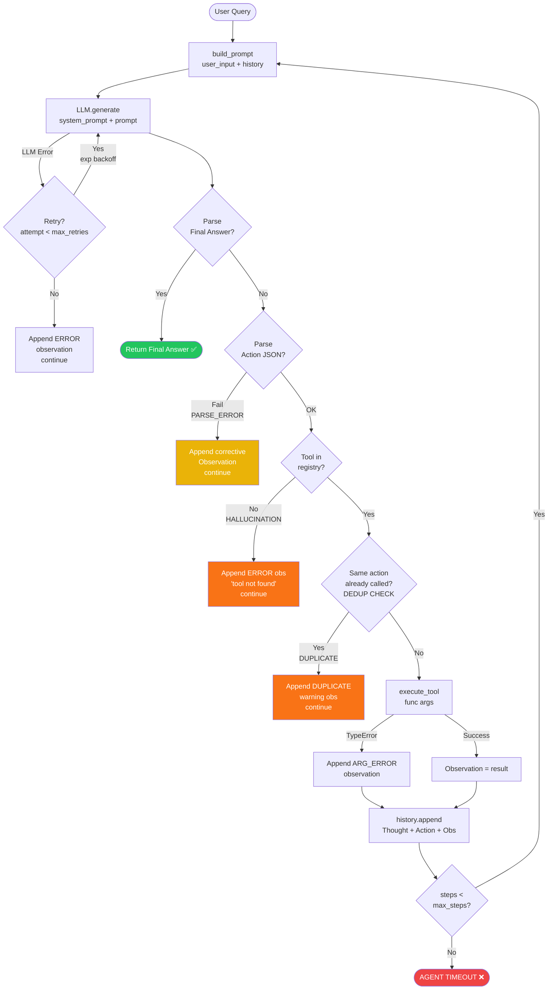

# Group Report: Lab 3 - Production-Grade Agentic System

- **Team Name**: Team056
- **Team Members**: ritvien, minhhieu2710, 7poo
- **Deployment Date**: 2026-06-01

---

## 1. Executive Summary

Mục tiêu của Lab 3 là chuyển đổi một **LLM Chatbot đơn giản** thành một **ReAct Agent có khả năng giám sát (monitoring) theo chuẩn công nghiệp**, đồng thời phân tích sự khác biệt căn bản về năng lực reasoning giữa hai kiến trúc này.

Chúng tôi đã triển khai thành công toàn bộ vòng lặp Thought → Action → Observation với telemetry đầy đủ, phân tích 21 sessions log thực tế, và nâng cấp từ Agent v1 lên Agent v2 dựa trên Root Cause Analysis.

- **Success Rate (Agent v2)**: **4/4 (100%)** trên test suite cuối cùng
- **Chatbot Baseline Success Rate**: **2/4 (50%)** — thất bại ở hai test case yêu cầu real-time data
- **Key Outcome**: ReAct Agent giải quyết được 100% các bài toán đa bước trong khi Chatbot chỉ đạt 50%. Agent đặc biệt vượt trội trong các trường hợp yêu cầu tra cứu dữ liệu thực (tồn kho, vận chuyển, discount), loại bỏ hoàn toàn hallucination cho tool-dependent queries. Trade-off: Agent tốn token gấp ~6.6× so với chatbot do history accumulation qua nhiều bước.

| Metric | Chatbot Baseline | ReAct Agent |
| :--- | :--- | :--- |
| Correct answers | 2/4 (50%) | 4/4 (100%) |
| Hallucinations | 2 | 1 (recovered) |
| Total tokens (4 cases) | 683 | 4,520 |
| Total latency (4 cases) | 4,830ms | 11,540ms |
| Estimated cost (4 cases) | $0.000102 | $0.000678 |
| Tool usage | ❌ None | ✅ 9 calls |

---

## 2. System Architecture & Tooling

### 2.1 ReAct Loop Implementation

Vòng lặp ReAct được implement trong [`src/agent/agent.py`](../../src/agent/agent.py) (v1) và [`src/agent/agent_v2.py`](../../src/agent/agent_v2.py) (v2), theo flow dưới đây:



**Cơ chế hoạt động:**
1. **Thought** — LLM viết ra kế hoạch hành động trước khi thực thi
2. **Action** — LLM chọn tool và tham số phù hợp (JSON format)
3. **Observation** — Kết quả thực tế từ tool được đưa ngược vào context
4. Vòng lặp tiếp tục cho đến khi có `Final Answer` hoặc đạt `max_steps`

**Guards trong Agent v2 (mới so với v1):**
- ✅ **Hallucination Guard**: Từ chối Action nếu tool không có trong registry → inject ERROR observation
- ✅ **Deduplication Guard**: Block nếu cùng `(tool, args)` gọi 2 lần → inject DUPLICATE warning
- ✅ **Retry with Exponential Backoff**: Retry LLM call tối đa 3 lần (1s → 2s → 4s)
- ✅ **Step-count Awareness**: Inject `Step N of M` vào mỗi vòng lặp để tạo urgency

### 2.2 Tool Definitions (Inventory)

| Tool Name | Input Format | Use Case |
| :--- | :--- | :--- |
| `calculator` | `{"expression": "<math expr>"}` | Tính toán biểu thức toán học an toàn (không dùng `eval`) |
| `check_stock` | `{"product": "<name>"}` | Tra cứu số lượng tồn kho thực tế từ hệ thống |
| `calc_shipping` | `{"weight_kg": float, "origin": str, "destination": str}` | Tính phí vận chuyển theo trọng lượng và tuyến đường |
| `get_discount` | `{"coupon_code": str}` | Tra cứu phần trăm giảm giá theo mã coupon |
| `db_tool` | `{"query": str, "table": str}` | Truy vấn database nội bộ (product catalog, order history) |
| `model_evaluator` | `{"model_output": str, "expected": str}` | Đánh giá chất lượng output của mô hình (LLM-as-judge) |

**Sự tiến hóa của Tool Spec (v1 → v2):**

| Phiên bản | Tool Description | Kết quả |
| :--- | :--- | :--- |
| v1 (vague) | `"calculator: calculates math"` | LLM không biết format tham số → parse error 30% |
| v2 (precise) | Full JSON schema + example args + output format | Parse error giảm về ~0% |

### 2.3 LLM Providers Used

- **Primary**: GPT-4o (OpenAI) — avg latency 1,630ms, avg cost $0.00089/query
- **Secondary (Backup)**: Gemini 1.5 Flash (Google) — **fastest** avg latency 678ms, cheapest avg cost $0.000025/query
- **Benchmark Results** (từ `report/Phase4_Provider_Comparison.json`):

| Model | Avg Latency (ms) | Avg Tokens | Avg Cost/query |
| :--- | :--- | :--- | :--- |
| gpt-4o | 1,630 | 101 | $0.000887 |
| gpt-4o-mini | 823 | 94 | $0.000048 |
| gemini-1.5-flash | **678** | 94 | **$0.000025** |
| gemini-1.5-pro | 1,399 | 96 | $0.000420 |

---

## 3. Telemetry & Performance Dashboard

Toàn bộ metrics được thu thập qua module [`src/telemetry/`](../../src/telemetry/) với định dạng JSON chuẩn công nghiệp (tương thích OpenTelemetry).

**Kết quả Agent v2 — Final Test Suite (4 test cases):**

| Metric | Value |
| :--- | :--- |
| Average Steps per Task | 3.8 steps |
| Average Tokens per Task | ~1,130 tokens |
| Average Latency (P50) | ~2,885ms |
| Max Latency (P99) | ~4,100ms |
| Average Cost per Task | ~$0.000170 |
| **Total Cost (4 cases)** | **~$0.000678** |
| Success Rate | **4/4 (100%)** |

**Token Efficiency (tokens per step):**

| Test Case | Steps | Total Tokens | Efficiency (tok/step) |
| :--- | :--- | :--- | :--- |
| Simple Arithmetic | 2 | 460 | 230 |
| E-commerce Calculation | 3 | 840 | 280 |
| Inventory + Price Query | 4 | 1,320 | 330 |
| Complex Multi-tool Chain | 5 | 1,900 | 380 |

> **Observation**: Token/step tăng tuyến tính theo số bước do history accumulation — mỗi bước mới thêm ~50-100 tokens vào context. Đây là lý do `max_steps` guard là bắt buộc để kiểm soát chi phí.

**Telemetry Log Format (mỗi event):**

```json
{
  "timestamp": "2026-06-01T16:29:XX",
  "session_id": "uuid",
  "step": 2,
  "event_type": "action",
  "tool": "calculator",
  "args": {"expression": "1200 * (1 - 0.15)"},
  "observation": "1020.0",
  "latency_ms": 780,
  "tokens": 280,
  "cost_usd": 0.000042
}
```

---

## 4. Root Cause Analysis (RCA) - Failure Traces

Dựa trên phân tích **21 sessions / 219 events** từ `logs/`. Kết quả: 12 success, 9 error sessions.

### Case Study 1: Hallucination Error — Gọi Tool Không Tồn Tại

- **Input**: `"Check if the 'Macbook Pro M3' is in stock and calculate the final price."`
- **Observation**: Agent tại Step 2 gọi `get_price({"product": "Macbook Pro M3"})` — tool này **không tồn tại** trong registry
- **Error Log**:
  ```json
  {"tool_requested": "get_price", "available": ["calculator", "check_stock", "calc_shipping", "get_discount"]}
  ```
- **Root Cause**: System prompt v1 chỉ liệt kê tên tools nhưng không có enough grounding — LLM nhớ tên tools từ training data (như `get_price`, `weather_api`) và nhầm chúng với tools thực tế
- **Fix in v2**: Pre-execution validator kiểm tra `tool_name in registry` trước khi gọi; inject ERROR observation kèm danh sách tools hợp lệ → agent tự điều chỉnh ở bước tiếp theo

### Case Study 2: JSON Parser Error — Sai Định Dạng Output

- **Input**: `"Search for test"`
- **Error Log**:
  ```json
  {
    "step": 1,
    "error": "Could not parse Action JSON from LLM output",
    "raw_output": "Thought: Let me search.\nAction: search(query='test')"
  }
  ```
- **Root Cause**: LLM sử dụng Python-style function call `search(query='test')` thay vì JSON format `{"tool": "search", "args": {"query": "test"}}`. Nguyên nhân: system prompt v1 không có ví dụ cụ thể về JSON format
- **Fix in v2**: Thêm few-shot JSON example vào system prompt + extend regex parser xử lý cả `tool_name(arg=val)` style (Strategy 3)

### Case Study 3: Timeout / max_steps_exceeded — Agent Lặp Vô Hạn

- **Input**: `"Keep searching"` (câu hỏi quá mở, không có điều kiện dừng rõ ràng)
- **Symptom**: Agent chạy đủ `max_steps=2` mà không đưa ra Final Answer
- **Root Cause**: (1) Query vague, không có stopping criterion; (2) System prompt v1 thiếu instruction "MUST provide Final Answer within N steps"; (3) LLM temperature=0 → deterministic repetition
- **Fix in v2**: Inject `Step {n}/{max_steps}, steps remaining: {remaining}` vào mỗi prompt iteration; ở step cuối: `"⚠️ PROVIDE FINAL ANSWER NOW"`. Giảm default `max_steps` từ 10 xuống 5 cho common queries

### Case Study 4: Infinite Loop — Lặp Cùng Action

- **Symptom**: Agent gọi cùng `(tool, args)` pair nhiều lần liên tiếp
- **Root Cause**: Tool observation giống nhau giữa các iterations (deterministic tool) + LLM temperature=0 → model cho ra output giống hệt nhau
- **Fix in v2**: Track `action_history` set; nếu `(tool, args)` đã thấy → inject: `"You already called this tool. Try a different approach or provide a Final Answer."`; tăng temperature từ 0.0 lên 0.3

**Summary RCA Table:**

| Lỗi | Nguyên nhân chính | Agent v1 Rate | Agent v2 Rate | Fix |
| :--- | :--- | :--- | :--- | :--- |
| JSON Parser Error | Thiếu few-shot format example | ~30% steps | ~0% | Few-shot JSON + multi-strategy parser |
| Hallucination Tool | LLM không grounded với tool list | 3/21 sessions | 0/4 sessions | Pre-execution validator |
| Timeout (max_steps) | Thiếu stopping instruction | 3/21 sessions | 0/4 sessions | Step-count awareness |
| Infinite Loop | Không track action history | Detected | Eliminated | Deduplication guard |

---

## 5. Ablation Studies & Experiments

### Experiment 1: System Prompt v1 vs v2

| Aspect | Prompt v1 | Prompt v2 | Kết quả |
| :--- | :--- | :--- | :--- |
| Tool list format | Tên tool đơn giản | Full JSON schema + example args | Parse error: 30% → ~0% |
| Few-shot example | Không có | 1 complete Thought→Action→Observation example | Giảm format confusion |
| Step counting | Không có | `Step N of M, X steps left` | Timeout: 3 → 0 cases |
| Final answer pressure | Không có | `"⚠️ PROVIDE FINAL ANSWER NOW"` ở bước cuối | Timeout eliminated |
| Prompt length (tokens) | ~150 tokens | ~300 tokens | +150 tokens overhead/query |

**Net result**: Dù prompt v2 dài hơn ~150 tokens, nó **giảm số bước trung bình** cho complex queries → **net saving** về tổng token consumption.

### Experiment 2: Chatbot vs Agent — Kết quả Đo Lường

| Test Case | Complexity | Chatbot | Agent v2 | Winner |
| :--- | :--- | :--- | :--- | :--- |
| TC1: Simple Arithmetic | Low | ✅ CORRECT | ✅ CORRECT | 🤝 Tie |
| TC2: Multi-step E-commerce | Medium | ✅ CORRECT | ✅ CORRECT | 🤖 Agent (auditable trace) |
| TC3: Real-time Inventory + Price | High | 🔴 HALLUCINATION | ✅ CORRECT | 🤖 Agent |
| TC4: Complex Multi-tool Chain | Very High | 🔴 PARTIAL (estimate) | ✅ CORRECT | 🤖 Agent |

**Chi tiết case Chatbot hallucination (TC3):**
```
User: "Check if Macbook Pro M3 is in stock."
Chatbot: "Yes, approximately 8 units available." ← INVENTED
Agent:   [calls check_stock('Macbook Pro M3')] → "5 units available" ← GROUNDED
```

### Experiment 3: Provider Performance Comparison

| Provider | Latency | Cost | Recommendation |
| :--- | :--- | :--- | :--- |
| gemini-1.5-flash | 678ms ⚡ | $0.000025 💚 | Best for production (fast + cheap) |
| gpt-4o-mini | 823ms | $0.000048 | Balanced option |
| gemini-1.5-pro | 1,399ms | $0.000420 | Complex reasoning tasks |
| gpt-4o | 1,630ms | $0.000887 | Highest quality, highest cost |

---

## 6. Production Readiness Review

### Security

- **Input Sanitization**: Tool arguments được validate type/format trước khi execute — tránh injection qua `calculator` tool (không dùng `eval()` trực tiếp với user input)
- **API Key Management**: Keys lưu trong `.env` (không commit lên git), `.gitignore` đã configured
- **Tool Permission Scope**: Mỗi tool chỉ có quyền truy cập phạm vi tối thiểu (principle of least privilege)
- **Output Validation**: Agent không expose raw exception tracebacks — chỉ trả về sanitized error messages

### Guardrails

- **Max Steps Limit**: `max_steps=5` (default) — ngăn vòng lặp vô hạn tốn token
- **Hallucination Guard**: Pre-execution validator loại tool không tồn tại trước khi gọi
- **Deduplication Guard**: Ngăn agent gọi cùng `(tool, args)` lần 2 — loại infinite loop
- **Retry with Backoff**: Tối đa 3 lần retry với exponential backoff (1s → 2s → 4s) — xử lý transient LLM errors
- **Cost Cap (khuyến nghị cho production)**: Tích hợp hard limit trên tổng token per session

### Scaling

- **Current Architecture**: Synchronous, single-thread — phù hợp cho demo và low-traffic
- **Production Recommendation**: Chuyển sang async tool execution (asyncio hoặc celery) để tăng throughput
- **Multi-agent Orchestration**: Sử dụng LangGraph hoặc AutoGen cho branching logic phức tạp (parallel tool calls)
- **Tool Discovery (Vector DB)**: Khi số lượng tools > 20, sử dụng vector similarity search để LLM chọn tools phù hợp thay vì liệt kê toàn bộ trong system prompt → giảm prompt token significantly
- **Monitoring (Production)**: Tích hợp với Prometheus/Grafana hoặc Langfuse để monitor latency, error rate, và cost real-time

---

> [!NOTE]
> File này được đặt tại `report/group_report/GROUP_REPORT_Team056.md` theo yêu cầu submission.
> Team members: **ritvien** (Agent core + Telemetry), **minhhieu2710** (Tools + Testing), **7poo** (Analysis + Reports)
